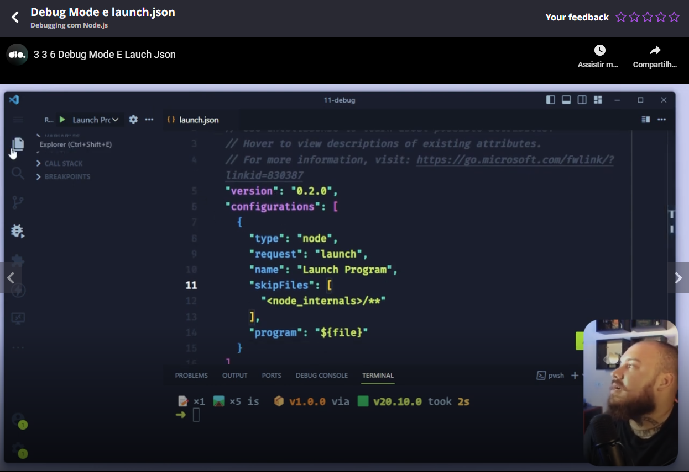

# Repository related to the classes

[link](https://github.com/digitalinnovationone/formacao-nodejs/tree/main/11-debug)


# Slides related to the classes

[link](https://hermes.dio.me/files/assets/fa353c56-279e-4fe8-a4d3-ef83fd0c3439.pptx)


# Steps of the first test

```sh
npm init -y
npm install -D typescript tsup tsx
echo "node_modules" > .gitignore
npx tsc --init
```

This will create the file tsconfig.json. Please see [this link](https://github.com/andreterceiro/dio-mobile-meu-tudo--how-to-configure-typescript-in-projects-node-js) to see what configurations you have to put in this file.

Teacher also suggested to add the configuration **type: "module"** to the file package.json.

As a second last step teacher suggested to create the file src/index.ts with this content

```
console.log("ola");
```

As the last step teacher suggested to create the script **start:dev** to initialize the application:


# Running an application in debug mode through package.json (in VSCode)


# Javascript debug terminal box (VSCode)

Is a box in VSCode:


# Problem with workspace not trusted in Windows

I had this problem in Windows and Blackbox AI suggested me:

```
O usuário está com problema no VSCode onde o workspace está configurado para "não confiar" e isso está impedindo o debugging. Preciso entender como resolver isso.

A questão é sobre configuração do VSCode para confiar no workspace quando ele está em modo não confiável. Isso é uma configuração de segurança do VSCode que restringe certas funcionalidades como debugging quando o workspace não é confiável.

Não preciso usar search_code aqui pois o número de arquivos é baixo (abaixo de 10) e a questão é mais sobre configuração do VSCode do que sobre código específico.

Para configurar o VSCode para confiar no workspace quando ele está em modo não confiável, siga estes passos:

Método 1: Via Interface do VSCode
Barra de notificação amarela: Quando você abre o workspace, deve aparecer uma barra amarela no topo com a mensagem "This workspace is not trusted"
Clique no botão "Trust" ou "Trust Workspace"
Confirme na caixa de diálogo que aparecer

Método 2: Via Command Palette
Pressione Ctrl+Shift+P (Windows/Linux) ou Cmd+Shift+P (Mac)
Digite: Workspace: Trust
Selecione "Workspace: Trust Window" ou "Workspace: Trust Workspace"

Método 3: Via Configurações
Pressione Ctrl+, para abrir as configurações
Procure por "trust"
Em "Security › Workspace › Trust: Enabled", certifique-se de que está habilitado
Clique no ícone de engrenagem e selecione "Trust Workspace"

Método 4: Arquivo de Configuração
Crie ou edite o arquivo .vscode/settings.json na raiz do seu projeto:
{
    "security.workspace.trust.enabled": true
}

Verificação
Após configurar:

Reinicie o VSCode
Verifique se a barra amarela desapareceu
Tente iniciar o debugging novamente (F5 ou Ctrl+F5)
Se ainda tiver problemas, verifique se há alguma extensão que possa estar interferindo ou se há políticas de segurança da empresa que impedem a alteração dessa configuração.
```

These tips did not work for me, I think that occurred because the network policies applied by the company, but I will try soon at home. 


# Left debugging bar


# Seeing variables values


A comment: if you have a breakpoint, you can see the variable value until this breakpoint.


# Global block


# Watch block

You can use the menu watch if you want to surveillance a variable.


As you can see in the previous image, you can watch a function with this block, but also variables.

Another point: in this block, on right of him, you have a "+" button to add something to the surveillance.


# Call stack


As you expect, you can identify in this block the order of the functions called in the execution.


# Loaded scripts


# Breakpoints


These numbers involved by a red circle refer the line of the breakpoint in a file.


# Flow control


As you can see in the top left part of the image, when debugging an application you have controls to control the flow of the application.


# Debug configuration


In this previous image teacher said us to click inthe link (is not a button, is a link, pay attention to the image) "create a launch.json file".

And then teacher said us to click in the Node.JS option.



As you can see in this previous image, VSCode creates a basic **launch.json** file.

Teacher suggested to clean all content in the configurations array. The he recommended to click in the button "add configurations" as you can see in the next image:


And then teacher suggested us to click in the option "Node.js: Attach to Process".

A comment: the "launch.json" file controls the behaviour of VSCode when debugging an application.